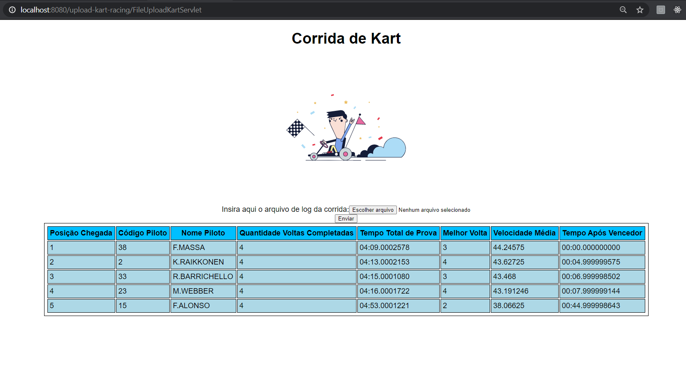

<h1 align="center">
    
</h1>

<h1 align="center"> 
    Corrida de Kart
</h1>

# Índice

- [Sobre](#sobre)
- [Tecnologias Utilizadas](#tecnologias-utilizadas)
- [Como Usar](#como-usar)
- [Como Contribuir](#como-contribuir)

## :bookmark: Sobre 

Desafio de desenvolver na linguagem JAVA uma aplicação que a partir de um input de um arquivo de log, montar o resultado da corrida com as seguintes informações: Posição Chegada, Código Piloto, Nome Piloto, Quantidade Voltas Completadas e Tempo Total de Prova.

## :rocket: Tecnologias Utilizadas

O projeto foi desenvolvido em JAVA WEB sem a utilização de frameworks.
- Utilizada a IDE Eclipse;
- Tomcat 9.0;
- JAVA JDK 1.8.0_131;

## :computer: Screens

<h4 align="center">
    
</h4>

## :fire: Como usar

- Clone esse repositório: `git clone https://github.com/diogobarreiros/upload-kart-racing.git`
- Importe o projeto na IDE Eclipse
- Adicione o projeto ao seu Servidor Tomcat instalado
- Inicie o Tomcat
- Tomcat configurado na porta 8080 o link será: http://localhost:8080/upload-kart-racing

## :page_with_curl: Arquivo de importação

Para efetuar a importação veja o arquivo teste <a href="https://github.com/diogobarreiros/upload-kart-racing/blob/master/WebContent/testFile/log-kart.txt" target="_blank">log-kart.txt</a>.

## :recycle: Como contribuir

- Faça um Fork desse repositório,
- Crie uma branch com a sua feature: `git checkout -b my-feature`
- Commit suas mudanças: `git commit -m 'feat: My new feature'`
- Push a sua branch: `git push origin my-feature`

---

<h4 align="center">
    Feito por <a href="https://www.linkedin.com/in/diogo-barreiros-b2a96836/" target="_blank">Diogo Barreiros</a>
</h4>
